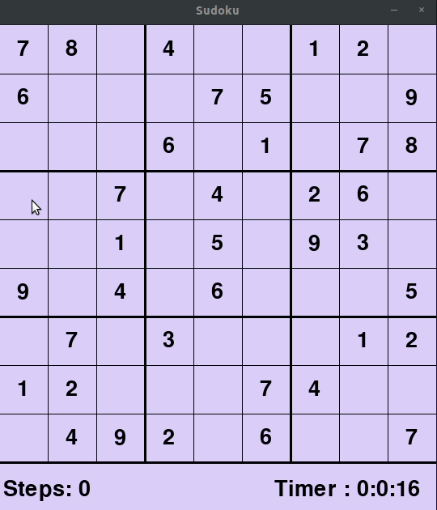

# Sudoku

Sudoku is a logic based number placement puzzle.The objective is to fill a 9×9 grid with digits so that each column, each row, and each of the nine 3×3 subgrids that compose the grid (also called "boxes", "blocks", or "regions") contain all of the digits from 1 to 9. The puzzle setter provides a partially completed grid, which for a well-posed puzzle has a single solution.
A sudoku puzzle can have multiple solutions.

The repository contains the python file for the game which has been implemented using the pygame library of python.
The code has been written using python3.

At start of the game we are provided with a 9x9 grid partially filled with numbers between 1 - 9.
We cannot change the values of this prefilled cells, in other words this values are part of the valid solution(if there exists any).

The functions implemented in the code are as:

1 - We can select any empty cell to enter a value in it.

2 - After selecting the cell we type in a number between 1 - 9 , the number is highlighted in the selected cell.Press Enter to fill the cell with this number . If the entered value is valid(satisfies rule of the game) it is placed into the cell else nothing gets placed.

3 - There is a timer at bottom of the window to record the game play-time and a step counter which counts the total number of steps taken.

4 - Press Spacebar to see the game solve itself.I have tried to visualise all the steps which the backtracking algorithm takes while solving the board.

Refer the gif below to see the game play.

